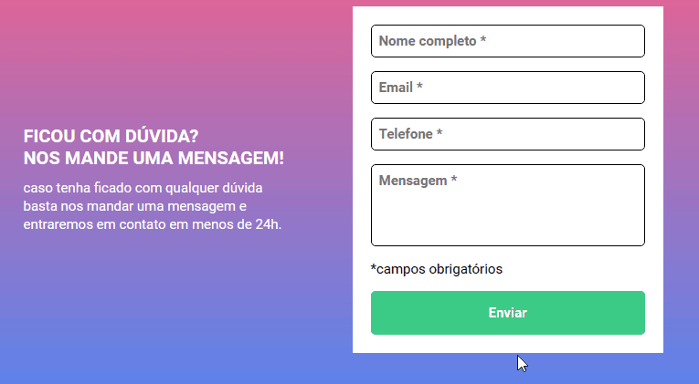

# DESAFIO - HTML/CSS/JS INTERMEDIÁRIO

Esta é uma solução para o desafio de [formulário com validação](
https://www.figma.com/file/zBKnYG9UNdUiIr8ClQTWSG/?node-id=3%3A2
). Esse desafio visa trabalhar os conhecimentos adquiridos ao longo do curso.

## Índice

- [Visão geral](#visão-geral)
   - [O desafio](#o-desafio)
   - [Captura de tela](#captura-de-tela)
- [Meu processo](#meu-processo)
   - [Construído com](#construído-com)
   - [O que aprendi](#o-que-aprendi)

## Visão geral

### O desafio

O formulário consiste em:

- Ao clicar para enviar, se caso algum campo não estiver preenchido, a borda do input ficará vermelha e uma mensagem de "campo obrigatório" irá aparecer embaixo do campo que não for preenchido.
- Se o usuário clicar dentro do campo de input e, logo após clicar fora do mesmo ou então, se o campo for preenchido e o dado digitado for excluído e clicado o click fora, a borda do campo ficará vermelho e a mensagem de "campo obrigatório" será exibida. 

### Captura de tela

.jpg)

.jpg)

.jpg)

.jpg)

## Meu processo

### Construído com

- Marcação HTML5 semântica
- Propriedades personalizadas CSS
- Interação com JavaScript

### O que eu aprendi

Esse desafio proporcionou-me desenvolver técnicas práticas de interação com JavaScript, permitindo um melhor entendimento de funções e de como manipular os objetos em geral.